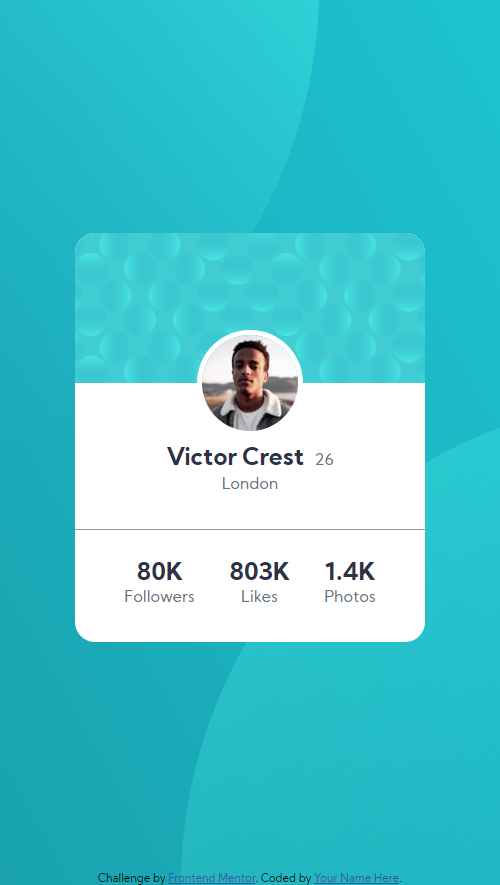
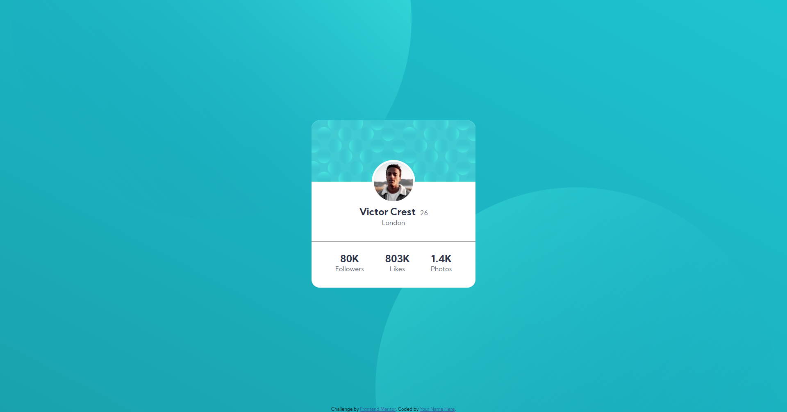

# Frontend Mentor - Profile card component solution

This is a solution to the [Profile card component challenge on Frontend Mentor](https://www.frontendmentor.io/challenges/profile-card-component-cfArpWshJ). Frontend Mentor challenges help you improve your coding skills by building realistic projects. 

## Table of contents

- [Overview](#overview)
  - [The challenge](#the-challenge)
  - [Screenshot](#screenshot)
  - [Links](#links)
- [My process](#my-process)
  - [Built with](#built-with)
  - [What I learned](#what-i-learned)
  - [Useful resources](#useful-resources)
- [Author](#author)

## Overview

### The challenge

- Build out the project to the designs provided

### Screenshot

## Mobile

## Desktop

### Links

- Solution URL: [Add solution URL here](https://your-solution-url.com)
- Live Site URL: [My site](https://hungry-morse-ff6404.netlify.app/)

## My process

### Built with

- Base HTML5 markup
- CSS Flexbox
- Pseudo Element 
- Desktop First Workflow
- Responsive Background

### What I learned

I learn how to use z-index with pseudo-element to make responsive background (2 ball at the background)

### Useful resources

- [Z-index for Pseudo Element](https://stackoverflow.com/questions/12463061/z-index-behaviour-on-pseudo-elementsm) - This post help me understand how z-index work for pseudo-element

## Author

- Website - [Tin.Pham](https://github.com/tin-pham)
- Frontend Mentor - [@phambaohuy12345](https://www.frontendmentor.io/profile/phambaohuy12345)
- Facebook - [Tin Pham](https://www.facebook.com/joseph.webdev)

